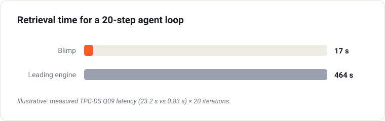

# Blimp prod-source kit

## Blimp

AI storage. AI queries. One platform. Blimp is an ACID cache that feeds GPUs at TB/s, and an autonomous query engine that answers in a second with RAG data. Launch a scalable Blimp node on any server, cloud instance, container or function runtime beside your existing pipeline — nothing migrates, cost drops → [blimp.software](https://blimp.software)

### The problem — AI runs on data it can't reach fast enough

- **GPUs starve** — training and inference read the datasets from object storage. Accelerators sit idle waiting for data, the most expensive waste in an AI budget.
- **Retrieval is the bottleneck** — agents reason in loops and call the data layer many times per answer. Inference returns in under a second; the lakehouse query behind it takes 20+ s, and that cost compounds on every iteration.
- **Split across two clouds** — GPUs run on a neocloud while RAG analytics and big data sit at a hyperscaler. You pay egress every time data crosses, so performance is hard to scale and cost hard to control.

Three symptoms, one cause: the data layer was never built for AI, or to sit where the GPUs are.

### The insight — everyone optimizes inference. We optimize retrieval inside the loop.

- Agents reason in loops — multi-shot queries and reinforcement-learning steps hit the data layer again and again before reaching the right answer.
- A faster engine still rescans the full table on every call, so latency and cost climb as data grows.
- Blimp stops scanning: views are authored once and refreshed in proportion to new data, not the table. Cost per answer stays flat as data grows.
- And the LLM receives only the data it needs — lower latency, fewer tokens.



Retrieval time for a 20-step agent loop: **464 s** on a leading engine against **17 s** on Blimp. Illustrative, from measured TPC-DS Q09 latency (23.2 s vs 0.83 s) over 20 iterations.

### Security — distributed ledger zero-trust

Identity is cryptographic rather than credential-based, so nothing in the pipeline is trusted by default.

- **Ledger-anchored identity** — every gateway, storage node and client holds a key pair anchored to a distributed ledger, so identity cannot be assumed by holding a stolen API key.
- **Signed, nonce-bound messages** — every inter-node message is signed and bound to a nonce, blocking replay and man-in-the-middle attacks.
- **Split-key authorization** — sensitive operations need sequential signatures from the client and an authorization server, so no single compromised key can act alone.
- **Tamper-evident history** — object version history and access grants are anchored to the ledger, making retroactive changes cryptographically detectable rather than dependent on access controls alone.
- **Per-node policy** — encryption at rest, ACID guarantees and immutability are set per node. An immutable allocation can be restricted to upload, list, download and share, with delete, rename, move and update disabled.

As autonomous agents gain access to enterprise data, an agent that can impersonate a service or replay a request becomes an attack vector. Per-message signatures and cryptographic identity close that path. Full details: [blimp.software/docs#security](https://blimp.software/docs#security)


`run-blimp` connects a **Blimp node** to **your application**, which can use
it for cache or query engine within your environment.

```
   ┌───── your node (any cloud) ─────┐     ┌─────── Blimp node ───────┐
   │  blimp CLI                      │     │  gateway                 │
   │  REST catalog  :8181  ──────────┼────▶│   S3 :9000               │
   │  your S3 / MinIO data           │ wire│   eblobbers              │
   └───────────────┬─────────────────┘     └───────────┬──────────────┘
                   └────── snapshot_changed webhook ─────┘
                          (your pipeline, on each commit)
```

The kit runs anywhere with a shell and network access to the Blimp node: a
bare-metal server, a VM, a container, a CI runner or a function runtime — and
on the Blimp node itself (the default on-prem layout, where it is installed
by the deploy). `--setup` probes how it can reach the node's gateway: on the
same private network it uses the private address and the node's own identity
(nothing to type); otherwise it uses the public endpoint. Where the DATA lives
is a separate choice (B below): the node's own fleet cache layer needs no keys
at all; another S3-compatible endpoint (MinIO, Ceph, R2, any cloud's S3) takes
its endpoint URL and keys.

For **production**, keep the client on the same private network as the Blimp
node so origin reads never leave it; a different network or cloud works but
adds hops and, across providers, egress cost on every read.


## Install

`blimp` is a self-contained CLI — install it once, then it bootstraps its own
prerequisites on first `--setup`. Two supported ways to get it:

```bash
# 1. one-line installer (open repo, no Docker) — puts `blimp` on your PATH
curl -fsSL https://raw.githubusercontent.com/0chain/run-blimp/main/install.sh | sh

# 2. or just clone and run in place
git clone https://github.com/0chain/run-blimp && cd run-blimp && ./blimp
```

You need **nothing** pre-installed — `blimp --setup` installs what it uses
(docker for the catalog, python + pyiceberg, aws CLI, duckdb, unzip). Set
`BLIMP_SKIP_DEPS=1` on hardened/offline hosts to manage deps yourself.

> **Docker alternative** (optional): a prebuilt image bundles everything, for
> hosts where you'd rather not install anything on the OS:
> ```bash
> docker build -t blimp-kit . && \
> docker run --rm --network host -e CLUSTER_ID=… -e WAREHOUSE=s3://… blimp-kit --setup
> ```
> `--network host` lets it use the node's own identity and reach the gateway
> on its private address (that is what makes the key-free path work). See `docker-compose.yml`
> to bring up the catalog + CLI together.

## Quick start — the `blimp` command, beginning to end

```
blimp                 list the commands
blimp --setup         connect a Blimp node to your data (interactive)
blimp --query         prove authoring + CDC delta-merge (your SQL with --sql)
blimp --storage       storage suite: TTFB, warp PUT/GET, MLPerf resnet50
blimp --acid          ACID / linearizability check of both data paths
blimp --bench         author / materialize / delta-merge timing profile
blimp --update        update software on the node: status | all | zs3,eblobber,nessie,gotenberg,rclone
                      (--tag svc=tag, --dry-run; runs on the node via its :9401 helper, one at a time)
```

Wiring is saved to `~/.blimp_env` by `--setup`; every command reads it.
**Running a command with no wiring offers to run `--setup` for you first.**

Rough timing: `--setup` about 10-15 minutes end to end (longer at SF100+),
`--query` about 5 minutes per query, `--storage` about 30 minutes for all three
legs, `--acid` about 5 minutes.

**Zero-touch / CI:** every prompt is skipped when its env var is pre-set —
export these (or source a file with `set -a`) and `--setup` runs unattended:

```
REGION CLUSTER_ID ICEBERG_URL WAREHOUSE ORIGIN_BUCKET NAMESPACE \
S3_KEY S3_SECRET        # only for an S3 endpoint you own (B = 2); the fleet option needs none
GW GW_AK GW_SK          # optional — auto-derived from CLUSTER_ID when unset
CATALOG_CHOICE=1|2|3    # A. Iceberg catalog: 1 = the node's own Nessie (default, nothing to
                        #    install; warehouse NAME via ICEBERG_WAREHOUSE, default "mv"),
                        #    2 = stand a Nessie up on this box (:8181), 3 = ICEBERG_URL you have
SOURCE_CHOICE=1|2       # B. dataset location: 1 = the fleet cache layer (default; the fleet
                        #    S3 URL + keys are fetched from the gateway), 2 = another S3 endpoint
BUILD_DATASET=1|2       # C. 1 = generate a TPC-DS test set at B and register it in A (default),
BLIMP_SF=1|10|100|1000  #    scale factor for it; 2 = bring your own data (ORIGIN_BUCKET/NAMESPACE)
```

Option 1 + 1 is the internal path: a node with no catalog, no bucket and no
data gets a working cluster in one command. Picking another S3 endpoint (B = 2)
with the node's Nessie (A = 1) is refused and demoted to a local catalog: the
gateway can only write table metadata into a warehouse *it* has configured,
which lives on the fleet endpoint, and the source config carries one
endpoint/key pair.

**Your own SQL and your own streamer.** `blimp --query --sql <file|dir>` runs any
SQL against the wired source; the tables it reads and its fact table are derived
from the SQL and the catalog (`query_tables.py`: names from FROM/JOIN, existence
from the catalog listing, fact = the referenced table with the most rows — the
gateway's own rule). Nothing about the dataset is assumed. In production your
streamer does the appends; `--tick-cmd '<cmd>'` runs it in phase 2 (with
`NAMESPACE`, `ICEBERG_URL`, `WAREHOUSE`, `S3_ENDPOINT` and the S3 keys in its
environment), after which the suite fires `snapshot_changed` for exactly the
tables your queries read and measures merge + serve. Without `--tick-cmd` the
TPC-DS seeder appends (test set only).

**What `--query` measures.** The suite runs against the source `--setup` wired
(the gateway calls it `customer`): phase 1 authors an MV from it and verifies
it, phase 2 appends rows to it (`seed_tpcds.py --tick`) and fires
`/admin/source/snapshot_changed`, phase 3 re-runs the query so the gateway
delta-merges the appended rows into the MV, phase 4 verifies the merged MV.
`--evict` forces a cold author first; `--verify` turns verification on (off by
default — that is the production path). Every phase shows up as a run on the
node panel's Query tab. `BLIMP_INGEST=1` additionally copies the namespace
into the cluster warehouse first (`/prod/ingest`, a full copy); it is not part
of the measurement.

### Step 1 — create a Blimp node

blimp.software → Create a Blimp node. Note the **node id**.

### Step 2 — `./blimp --setup` on your Iceberg node

Fully **interactive** — every value is prompted with a default (Enter accepts);
any env var already set skips its prompt (that's the zero-touch/CI path).
**The whole session, taking every default except the cluster id:**

```
$ blimp --setup

== blimp --setup — connect a Blimp node to this node's data ==
  ✓ deps ready (python: ~/.blimp_venv/bin/python3)
S3 region (cloud buckets only; any value for MinIO/other S3) [us-east-1]:
Blimp cluster id (from blimp.software): 1789395562780

network assessment → private gateway 10.10.12.249 reachable: yes (private path, nothing to type)
Blimp gateway address [10.10.12.249]:
Iceberg namespace [tpcds]:

Iceberg catalog
   1) use this cluster's gateway Nessie catalog (default, nothing to install)
   2) stand up an Iceberg REST catalog on THIS box (:8181)
   3) point at an Iceberg REST catalog I already have
  choice [1]:
  using the gateway Nessie catalog — http://10.10.12.249:19122/iceberg (branch main)
  Nessie warehouse name [mv]:
    warehouse "mv" -> s3://tpcds-mv (table metadata lands there)

Dataset (source) location
   1) the fleet cache layer — https://fleet-8429413131.blimp.software:9443 (default)
   2) another S3 endpoint (your own bucket / MinIO / other cloud)
  choice [1]:
  Bucket on the fleet endpoint [blimp-src]:
  source → https://fleet-8429413131.blimp.software:9443/blimp-src (fleet keys, fetched from the gateway)

Build a TPC-DS test dataset at that location?
   1) yes (default)
   2) no — I will bring my own data
  choice [1]:

Scale factor
   1) SF1    ~1 GB   (default — minutes)
   2) SF10   ~10 GB  (tens of minutes)
   3) SF100  ~100 GB (hours)
   4) SF1000 ~1 TB   (many hours; needs a big box + disk)
  choice [1]:
  will generate TPC-DS SF1 and register it into the catalog
  Warehouse (Nessie: a warehouse NAME; otherwise s3://bucket/prefix) [mv]:
```

That is the last prompt. Everything after it runs unattended: generate,
upload, register, save `~/.blimp_env`, wire the node, install the test tools.

**Bringing your own catalog and bucket** replaces three of those answers:

```
Iceberg catalog
  choice [1]: 3
  Iceberg REST URL: http://catalog.internal:8181
  REST prefix (Nessie branch; blank for a plain REST catalog):

Dataset (source) location
  choice [1]: 2
  Data bucket (blank = generate one here): my-lake
  S3 endpoint URL of that bucket (MinIO/Ceph/R2/any cloud, e.g. http://minio:9000;
    blank = your cloud's S3 in us-east-1) [https://s3.us-east-1.amazonaws.com]: http://minio.internal:9000

Build a TPC-DS test dataset at that location?
  choice [1]: 2
  Warehouse (Nessie: a warehouse NAME; otherwise s3://bucket/prefix) [s3://my-lake/wh]:
```

The prompts, in order (Enter takes the default; a pre-set env var skips the prompt):

1. `S3 region [us-east-1]` — only meaningful for a cloud bucket; any value otherwise
2. `Blimp cluster id (from blimp.software)` — required
3. `Blimp gateway address [<derived from the cluster id>]` — then the network
   assessment picks the private or the public path to it
4. `Iceberg namespace [tpcds]`
5. **A. Iceberg catalog** — `1) use this cluster's gateway Nessie (default)`,
   `2) stand up a Nessie on THIS box (:8181)`, `3) point at a catalog I already have`.
   Option 1 asks `Nessie warehouse name [mv]` and probes it; option 3 asks the
   REST URL and its prefix (blank for a plain REST catalog).
6. **B. Dataset (source) location** — `1) the fleet cache layer (default)` →
   `Bucket on the fleet endpoint [blimp-src]` (fleet URL + keys are fetched from
   the gateway, nothing to type); `2) another S3 endpoint` → data bucket
   (blank = generate one here) and its S3 endpoint URL (MinIO, Ceph, R2, any
   cloud's S3; blank = your cloud's S3 in the region above).
   Picking 2 with option A1 is refused and demoted to a local catalog (see the
   note under the env block).
7. **C. Build a TPC-DS test dataset at that location?** — `1) yes (default)` →
   `Scale factor 1 / 10 / 100 / 1000`; `2) no, I bring my own data`.
8. `Warehouse` — prefilled with the Nessie warehouse NAME (A1/A2) or
   `s3://<data-bucket>/wh` (A3)
9. S3 access key / secret — asked only for an S3 endpoint you own that the node
   cannot reach with its own identity; the fleet option needs none

With C = yes it then generates the 24 tables (duckdb `dsdgen`), uploads them to
the location from B, and registers them into the catalog from A. Nothing else
is asked.

Guardrails `--setup` enforces (each is a real failure mode):

1. **Warehouse co-located with the data bucket.** A warehouse in a different
   bucket breaks the gateway's catalog-metadata reads → MV author refuses
   ("grain not sampleable"). Divergence warns and offers to fix.
2. **Bucket access grant** (vpc/same-account): applies a bucket policy for the
   gateway's own identity + your account — no silent 403 at author time.
3. **Blank keys are the normal answer** — keys are only typed for an S3
   endpoint you own that the node cannot reach with its own identity.

**What `--setup` does, in order:**

1. **Deps bootstrap** — installs docker / python venv + pyiceberg / aws CLI /
   unzip if missing (`BLIMP_SKIP_DEPS=1` to manage yourself).
2. **Network assessment** — probes the gateway's private address → private
   path (nothing to type) or the public endpoint.
3. **Catalog (A)** — the gateway's own Nessie (nothing to run), a Nessie stood
   up here with the same recipe as the node's (`docker run`, :8181), or a REST
   catalog you already have. Both Nessie options are one catalog type, so
   there is one dialect to reason about; a Nessie warehouse is a server-side
   NAME (`mv`), never an `s3://` path.
4. **Dataset (B) + test set (C)** — generate TPC-DS at the chosen scale, upload
   it to the fleet cache layer (or your S3), register the tables into A.
5. **Bucket grant** — only when the bucket is in the same cloud account as the
   node (a bucket policy for the gateway's role); every other endpoint is
   reached with the keys you gave, nothing to grant.
6. **Saves the wiring** to `~/.blimp_env` (mode 600) for every later command.
7. **Wires the Blimp node over its admin API** — no SSH, no restart:

   ```
   POST http://<gateway>:9000/admin/source/configure
   Authorization: Bearer <the node's live admin token>
   {"source":"customer","iceberg_url":"<catalog as the GATEWAY reaches it>|<warehouse>",
    "namespace":"…","bucket":"…","s3_endpoint":"…","s3_key":"…","s3_secret":"…","s3_region":"…"}
   ```

   Two addresses for one catalog: with option A1 you reach the gateway's Nessie
   on the host port (`http://<gateway>:19122/iceberg`), but the gateway runs in
   a container where that is loopback to itself, so `--setup` sends the
   gateway its own catalog address (`ZS3_ICEBERG_REST_URL`, read from the
   co-located container) and keeps the host address for the registrar and
   seeder. The bearer is the node's live admin token (the datalake-minted fleet
   token, kept fresh in `/opt/0chain/zs3server/environment/admin_token`), not
   `blimp-<id>`. The gateway applies the config live — the very next query
   reads your data — and persists it across restarts. On success `--setup`
   prints `✓ cluster wired: source=customer … (live, no restart)`.
8. **Finishing** — fetches the gateway's S3 keys into `~/.blimp_env` and
   installs the benchmark tools (`warp`, `mount-s3`, `dlio`, the ACID checker).

Finally it prints the same values for the Blimp node UI (Query Optimizer →
Production, the manual path) and the `snapshot_changed` webhook for your
pipeline.

### Step 3 — register your tables (optional)

`--setup` already registers the test dataset it generates. Do this only for
**your own** parquet that is not in the catalog yet — it is `add_files`
registration, so no data is copied:

```
~/.blimp_venv/bin/python3 register_tpcds_tables.py \
  --catalog http://localhost:8181/iceberg --prefix main --warehouse src \
  --source-bucket my-bucket --namespace myns \
  --s3-endpoint http://minio.internal:9000 --s3-key … --s3-secret …
```

Against **Nessie** (both catalog options the kit stands up, and the Blimp
node's own) `--warehouse` is the server-configured **name** (`src`, or `mv` on
the node) and `--prefix` is the branch, normally `main`. Against a plain REST
catalog drop `--prefix` and pass the warehouse as an `s3://…` path. Omit
`--s3-*` when the host reaches the bucket with its own identity.

### Step 4 — point the Blimp node at the source (optional)

**Automatic (no SSH):** `--setup` wires the node itself over the authenticated
admin API — `POST http://<gw>:9000/admin/source/configure`, with the node's
live admin token as the bearer (read from the node when the kit runs on it,
else `CLUSTER_TOKEN` from `~/.blimp_env`). The gateway applies the source in
its live env (effective on the next query, **no restart**) and persists it
across reboots. On an older gateway image the call fails gracefully and
`--setup` prints the manual steps.

Manual fallback (older gateway image, or the admin-API call failed): paste
`--setup`'s printed values into the Blimp node UI (Production tab).

An S3 endpoint you own (B = 2) **requires** `S3_KEY`/`S3_SECRET`; `--setup`
sends them in the `/admin/source/configure` body. For the fleet cache layer,
or a bucket the node reaches with its own identity, leave them unset.

> Firewall: this only applies when the catalog runs **here** (A = 2 or 3) — the
> gateway must reach it on the catalog port. If 8181 is closed between the two,
> publish it on an open port (`ICEBERG_PORT=8081 blimp --setup`) and use that
> URL. With the default A = 1 the catalog is the node's own, so there is
> nothing to open.

## Fleet — one S3 URL for all your nodes

When you run more than one Blimp node, they form a **fleet** with a **single
S3 endpoint** and **one shared key** — you never juggle per-node URLs. Point any
S3 tool or a `mount-s3` (FUSE) client at it and you see your **entire namespace**,
no matter which node stores each object; content is deduplicated fleet-wide
(identical data kept once across all nodes), and the URL is round-robin +
health-checked, so a node going down moves traffic to a healthy one.

- **Endpoint:** `https://fleet-<account>.blimp.software:9443` (TLS, path-style)
- **Credentials:** your account's shared fleet S3 key (Access + Secret)
- **S3 tools:**
  ```
  mc alias set fleet https://fleet-<account>.blimp.software:9443 <AK> <SK>
  aws --endpoint-url https://fleet-<account>.blimp.software:9443 s3 ls
  ```
- **FUSE (mp-s3) — same endpoint, same key:**
  ```
  mount-s3 --force-path-style --endpoint-url https://fleet-<account>.blimp.software:9443 <bucket> /mnt/fleet
  ```

Any node resolves the full namespace (content-addressed dedup index +
cross-node fetch), and a cross-node read that hits a transient break is retried
**server-side** — the client never sees a truncated stream. Prefer the fleet URL
over a per-node `blimp-<node>-0.blimp.software:9443` for anything user-facing.

> One connection lands on one node, so a **single** client is bounded by that
> node's link — run several clients (or several mounts) to aggregate across the
> fleet. `blimp --storage` deliberately does **not** do this: it drives the one
> node in `~/.blimp_env` (`GW`) so the numbers describe that node's storage. To
> measure the fleet, run the suite from several clients at the fleet URL.

> **Dedup and benchmarks.** Because identical content is stored once fleet-wide,
> the *second* node to write the same bytes keeps only the name — reads there are
> served from the node that holds them. That is correct for storage and wrong for
> a storage benchmark, which would then be measuring the link between nodes. The
> mlperf leg prints a `cross-node` count for exactly this reason, and the bench
> upload asks the gateway to keep a local copy (`x-amz-meta-zus-dedup: off`) so
> the measurement stays on the node under test.

## Testing the Blimp node

The `--query`, `--storage`, and `--bench` commands are **testing/validation
tools** — they prove the wiring, measure the node, and gate a rollout. They are
not part of production operation (production is your pipeline + the
`snapshot_changed` webhook from Step 4).

### A — `./blimp --query` (prove authoring + CDC)

**What it does.** Four phases against the source `--setup` wired, per query:

| phase | what happens | what you get |
|---|---|---|
| 0 (with `--evict`) | drop each query's MV, keep its recipe | a genuinely cold start |
| 1 | run the query → the node authors an MV from your source | `author_ms`, `materialize_ms`, `verify_ms`, `cold_serve` |
| 2 | append rows to the source, then `POST /admin/source/snapshot_changed` | the appended row counts + new snapshot ids |
| 3 | run the query again → the node delta-merges the appended rows | `merge_ms`, `mode`, `incr_query` (the warm serve) |
| 4 (with `--verify`) | re-check the merged MV against the source | `verify_status` |

```
blimp --query                                  # the default batch, 10 queries
blimp --query --queries "3 7 19"               # pick TPC-DS queries
blimp --query --sql ./my_query.sql             # YOUR SQL (any dataset)
blimp --query --sql ./queries/                 # a directory of .sql files
blimp --query --sql q.sql --tick-cmd './my_streamer.sh'   # YOUR appender in phase 2
blimp --query --evict --verify                 # cold start + correctness check
blimp --query --append-rows 50000              # bigger CDC tick (default 5000)
```

With `--sql` nothing about the dataset is assumed: the tables a query reads are
parsed out of its `FROM`/`JOIN` clauses, checked against the catalog listing,
and the **fact** is the referenced table with the most rows (the node's own
rule) — so `snapshot_changed` fires for exactly the tables your query touches.
With `--tick-cmd` your own streamer does the phase-2 append (it runs with
`NAMESPACE`, `ICEBERG_URL`, `WAREHOUSE`, `S3_ENDPOINT` and the S3 keys in its
environment); without it the built-in TPC-DS seeder appends, which only works
on the test dataset.

**Reading the result.** One row per query, e.g.:

```
query  fact           mv_rows x cols  author_ms  merge_ms      mode  incr_ms  delta_rows  delta_verdict
q1     store_returns      177924x5         4270     19216  incremental     329          50  merged
```

`merge_ms` only counts when `delta_verdict` is `merged` — `UNCHANGED` or
`EMPTY` mean the append produced no delta for that MV and the number measured
nothing. `mode=incremental` is the delta-merge fast path; `no-delta` is a full
re-author; "no MV — served from base" means the query authored nothing and
scanned the source. There is **no PASS/FAIL verdict**: those outcomes are
judgements, not thresholds. Every phase also appears as a run on the node
panel's **Query** tab.

`--verify` is off by default because the node runs no verification while
serving, so an unflagged run measures the production path.

Multi-fact batches still work: `SUITES="store_sales:3 19 43;store_returns:1"`.
Join-CTE queries (q64-class) only see a delta when the append touches **both**
sides of the join — the seeder therefore appends referentially — so a
sales-only append correctly reports `no-delta`, not a bug.

### B — `./blimp --storage` (storage & cache suite)

**What it does.** Drives the node's S3 endpoint from this client and reports
what the storage path actually delivers. Three legs:

| leg | workload | what you get |
|---|---|---|
| `ttfb` | 1 KiB objects, PUT then single-stream GET | first-byte latency (median / 99th) |
| `warp` | 96 MiB objects, PUT then GET, sized to exceed the node's RAM | sustained PUT and GET MiB/s, error count |
| `mlperf` | MLPerf Storage resnet50 (dlio) reading through mountpoint-s3 | accelerator utilisation (AU %), samples/s, MB/s |

```
blimp --storage                          # all three legs (~30 min)
STORAGE_LEGS=mlperf blimp --storage      # one leg
STORAGE_LEGS=warp,ttfb blimp --storage   # several
WARP_BUDGET_MIB=5120 MLPERF_NUM_FILES=35 blimp --storage    # cap sizes on a small node
MLPERF_ACCELS=2 blimp --storage          # more accelerators (more read concurrency)
BENCH_KEEP=1 blimp --storage             # keep the scratch buckets for a re-run
```

Self-contained: it installs its own tools (warp pinned v1.1.4, mount-s3, dlio
+ an MPI runtime) before running, `BLIMP_SKIP_DEPS=1` opts out, and a leg whose
tool still cannot install is skipped loudly rather than reported as zero.

**Reading the result.** The tail of the run prints one summary:

```
  warp    S3 PUT 593 MiB/s · GET 938 MiB/s
  TTFB    median 3ms, 99th 6ms
  mlperf  read AU 97.16% · 4062 samples/s · 557 MB/s
  mlperf  cross-node: 0 — all reads served by this node's blobbers
```

AU is the MLPerf verdict — it is the fraction of time the accelerator had data
to work on, so ≥90% means storage kept up. The **cross-node** line matters on a
multi-node fleet: identical content is stored once, so a node that did not
write the dataset reads it from the node that did, and a non-zero count means
the number above measured the link between nodes rather than this node's own
storage. Each leg also registers itself on the node panel's **Benchmarks** tab,
so a client-run result sits next to the ones started from the UI.

### C — `./blimp --bench` (timing profile)

Bench = min/median/avg/max author / materialize / delta-merge profile, one run
per query of the selected batch (`ITERS AUTHOR_ITERS CDC_ROWS` default 3/3/50000;
the batch defaults to the same `--first-10` as `--query` and takes the same
`--queries` / batch flags; `BENCH_QNR=64` benches exactly one query from
`$Q_DIR/q<N>.sql`; `BENCH_FACT=catalog_sales` appends referentially for
join-CTE queries).

Check the `n=` on each summary line before quoting it — an append that
re-materializes instead of merging contributes no `delta_merge_ms`, so `n` can
be lower than `ITERS`. See the worked example in the walkthrough below for what
the numbers do and don't mean.

### D — Testing ACID (`blimp --acid`)

A Blimp node is not a single disk — a write is erasure-coded across many
independent blobbers, and reads are served through several front-ends (the
gateway S3 API, a read-through cache, a mounted filesystem). `--acid` proves
that this distributed stack still behaves like one correct store: a value you
just wrote is the value everyone reads, and a read that races an overwrite
never returns a stale copy or a torn mix of the old and new bytes.

> **ACID is OFF by default on the gateway, and `--acid` turns it on for you.**
> As of 2026-08-06 the gateway defaults `ZS3_ACID_ALL` to off: the warp
> benchmark that argued strict whole-file verify was free is the same tool that
> produced the phantom `EOF` errors, so it cannot be used to justify paying that
> cost on every deployment. `ZS3_ACID_BUCKETS` still keeps the MV warehouse
> buckets strict.
>
> `blimp --acid` arms it via `POST /admin/acid` before the run and restores the
> previous setting afterwards — including on failure or Ctrl-C. That pin is a
> RUNTIME setting and is not persisted, so a gateway restart reverts to
> `ZS3_ACID_ALL` regardless.
>
> **If you run the porcupine checker by hand, arm it yourself first** — a
> linearizability test against a gateway with ACID off is measuring the wrong
> configuration, and any torn read it reports says nothing about the ACID path:
>
> ```bash
> set -a; . ~/.blimp_env; set +a          # GW + CLUSTER_TOKEN (the node's live admin token)
> curl -X POST http://$GW:9000/admin/acid \
>   -H "Authorization: Bearer $CLUSTER_TOKEN" \
>   -H 'Content-Type: application/json' -d '{"enabled":true}'
> # ... run the test ...
> curl -X POST http://$GW:9000/admin/acid \
>   -H "Authorization: Bearer $CLUSTER_TOKEN" \
>   -H 'Content-Type: application/json' -d '{"enabled":false}'
> ```
>
> Leaving it pinned on makes every LATER benchmark quietly pay the ACID cost —
> which is exactly how a misleading measurement gets made.

It uses [porcupine](https://github.com/anishathalye/porcupine), the same
linearizability model-checker used in Jepsen distributed-systems testing. Many
clients hammer the same keys with concurrent writes and reads; porcupine then
searches for *any* ordering of those operations consistent with a single
correct register. If none exists, the history is **NOT LINEARIZABLE** and the
offending operation is reported. It runs against **both read paths**, each
under two profiles:

| Path | What it is |
|------|------------|
| **gateway S3 :9000** | the raw S3 API → gosdk → blobbers |
| **mountpoint-s3** | the gateway bucket mounted as a POSIX filesystem (the mlperf / customer mount path) |

- **single-writer** — one client writes a key while N clients read it. This is
  the read-after-write guarantee an object store actually promises; a stale or
  torn read here is a genuine consistency bug.
- **multi-writer** — every client both writes and reads the shared keys, a
  stricter total-order probe. (High "errors" counts on the FUSE leg are
  just the client refusing two concurrent writers to one key — the verdict is
  over the operations that *completed*.)

```bash
blimp --acid
# tune with ACID_CLIENTS (8), ACID_KEYS (4), ACID_DURATION (45s)
```

A clean run prints `LINEARIZABLE` for every leg — read-after-write is preserved
and no torn erasure-decode is ever exposed, whether you reach the node over S3
or as a mounted filesystem. `--setup` builds the checker (a
small Go program under `acid/`) automatically; it needs no configuration beyond
the gateway S3 keys already in your wiring. Run the checker from a box **other
than the gateway** (e.g. the Iceberg node) — co-locating the load generator on a
small gateway can starve it and produce spurious `Illegal` verdicts. (A
concurrent-read `unexpected EOF` from the `warp` load tool specifically is a warp
client artifact, not a consistency failure — verified separately with `aws s3
cp` md5 checks that pass byte-for-byte with the strict ACID verify on and off.)

---

## Reference

- **[WALKTHROUGH.md](WALKTHROUGH.md)** — a full transcript, every command and its
  real output, on a fresh node. Captured before the A/B/C setup options: the
  shape is right, the catalog and the default source have changed (see Step 2).
- **[TESTING.md](TESTING.md)** — testing the kit itself: `./test_kit.sh`,
  `./test_setup_options.sh`, `python3 test_seed_tpcds.py`. All offline.
- Product docs: [docs.zus.network/zus-docs/webapps/blimp](https://docs.zus.network/zus-docs/webapps/blimp)
  — the optimizer, incremental MVs (CDC), and the Prod-Query & MV API.

---

## Verified walkthrough (real commands + output)

A fresh Ubuntu 24.04 cloud VM on the cluster's private network, cluster
`1784970467881`. Every line below is the actual command and its actual
output from a live run.

> **Historical transcript (captured before the A/B/C setup options).** It is
> kept because every line is real output from a live run, but the current
> `--setup` differs: it asks the three catalog / source / dataset questions
> shown in Step 2, the local catalog it stands up is **Nessie** (not
> `tabulario/iceberg-rest`), the default source is the node's own fleet cache
> layer, and the admin bearer is the node's live token rather than
> `zus-<cluster-id>`. Follow Step 2 for what a run looks like today.


**1. Confirm the node's identity (no keys anywhere).**
```
$ whoami; hostname; hostname -I
ubuntu
ip-10-10-12-62
10.10.12.62 172.17.0.1

$ curl -s -H "X-aws-ec2-metadata-token: $TOK" \
    http://169.254.169.254/latest/meta-data/iam/security-credentials/
ec2-ssm-role-1784970467881
```

**2. One command does setup end-to-end** (deps → mode → catalog → wiring).
`blimp --setup` on the bare box:
```
== blimp --setup — connect a Blimp cluster to this node's data ==
== checking prerequisites ==
  installing: docker-compose-v2               # ← installs its own missing deps
  ✓ deps ready (python: /home/ubuntu/.blimp_venv/bin/python3)

network assessment → MODE=vpc (gateway private 10.10.12.249 reachable: yes)
  gateway → 10.10.12.249 · advertise this node as → 10.10.12.62 · S3 creds → blank (IAM instance role)

standing up an Iceberg REST catalog on :8181 over s3://blimp-tpcds-sf1-aps1/wh3
 Container iceberg-rest  Started
  Iceberg catalog up — cluster reaches it at http://10.10.12.62:8181
saved wiring -> /home/ubuntu/.blimp_env

================= POINT THE BLIMP CLUSTER AT THIS SOURCE =================
  Iceberg REST URL : http://10.10.12.62:8181
  Warehouse        : s3://blimp-tpcds-sf1-aps1/wh3
  Namespace        : tpcds_sf1x
setup done — validate with:  blimp --query   (and  blimp --storage )
```
(The `installing: docker-compose-v2` line was later removed — the catalog now
starts with a plain `docker run`, so the client box needs only the docker
engine, no compose plugin.)

**3. Register your parquet as Iceberg** (once):
```
$ ~/.blimp_venv/bin/python3 register_tpcds_tables.py --catalog http://localhost:8181 \
    --warehouse s3://my-bucket/wh --source-bucket my-bucket --namespace tpcds_sf1x
registered 24/24 tables into http://localhost:8181 ns=tpcds_sf1x
```

### Testing the Blimp node (walkthrough)

The remaining items are the TESTING commands — validation of the wired node,
not production operation.

**A. `blimp --query` — author + incremental CDC:**

Five queries against a single fact, appending to all five facts each cycle so a
multi-fact query exercises a multi-fact merge. Live run, SF1 cluster
`1785550395356`, 2026-08-01:
```
== CDC bench: cluster=1785550395356 gw=10.10.114.87 rows/append=5000 suites=[store_sales:9 88 14 64 4] ==
==== fact: store_sales (q9 q88 q14 q64 q4) ====
>> phase 1: serve/author all (force_author=0)
   q9: author=? materialize=? cold_serve=2826ms mv=?x? (mv_h_0e90d0b63216)
   q88: author=? materialize=? cold_serve=2668ms mv=?x? (mv_h_ae8ceee390cc)
   q14: author=12252 materialize=? cold_serve=3134ms mv=?x? (none)
   q64: author=? materialize=? cold_serve=2657ms mv=?x? (mv_h_ad47f860697f)
   q4: author=45048 materialize=? cold_serve=2971ms mv=?x? (none)
>> phase 2: append +5000 to [store_sales store_returns catalog_sales catalog_returns web_sales] + snapshot_changed
tpcds.store_sales: +5000 rows -> snapshot 3827416906052195600
tpcds.store_returns: +5000 rows -> snapshot 686337096249913447
tpcds.catalog_returns: +1666 referential rows -> snapshot 6382376194974615624
tpcds.catalog_returns: +5000 rows -> snapshot 7838483972766842389
tpcds.web_sales: +5000 rows -> snapshot 4945461575749320971
>> phase 3: re-run all (incremental)

============================== CDC CONTRIBUTIONS ==============================
query      fact             mv_rows x cols   author_ms   merge_ms     mode   incr_ms
q9         store_sales                 ?x?           ?       5879 incremental      2781
q88        store_sales                 ?x?           ?       6507 incremental      2693
q14        store_sales                 ?x?       12252          -        -      3031
q64        store_sales                 ?x?           ?       8856 incremental      3875
q4         store_sales                 ?x?       45048          -        -      2959
  q9: MV mv_h_0e90d0b63216 — delta-merged
  q88: MV mv_h_ae8ceee390cc — delta-merged
  q14: no MV — served from base
  q64: MV mv_h_ad47f860697f — delta-merged
  q4: no MV — served from base
```
How to read it: `mode=incremental` with a `merge_ms` means the MV was refreshed
by an append-only delta-merge (the O(|MV|+|delta|) fast path). A query with no
MV serves from base and reports `author_ms` instead — q14 and q4 do that here,
which is a real gap, not a pass/fail. There is no PASS/FAIL line: the suite
reports what happened and you judge it.

An append that fails leaves nothing to merge, and phase 3 then measures
UNCHANGED data while still printing plausible-looking `no-delta` rows. The suite
now prints the seeder's full traceback and says so explicitly when that happens
— if you see `APPEND FAILED`, every number below it is meaningless.

**B. Raw stop/start (all 4 instances) → self-heal + re-validate:**
```
private IPs unchanged; all 4 public IPs changed
DNS reconciled by the 60s cron (no touch):
  zus-1784970467881-0 -> 13.201.26.189   (gateway)
  zus-1784970467881-1 -> 3.110.120.231   (blobber-1)
  zus-1784970467881-2 -> 13.127.74.12    (blobber-2)
  zus-1784970467881-3 -> 3.111.245.151   (blobber-3)
post-restart q1: merge_ms=5138 mode=incremental   RESULT: PASS
```

**C. External-cloud host** (a different network, over public DNS):
```
network assessment → MODE=external (gateway private unknown reachable: no)
live query over zus-1784970467881-0.zus.network:9000
  {status: ok, rows: 1, author_ms: 575, query_ms: 2447, md5: 7a26dcec…}
```

**D. `blimp --storage` numbers** (2/1 cluster, 5 GB warp set):
```
warp   S3 PUT 749 MiB/s · GET 1673 MiB/s   (0 errors)
```

Those are from a 2/1 cluster on larger instances. Size the benchmark set to
the cluster — a single 17 MB object measures nothing and reports throughput
as *slower* than expected purely from per-request overhead.

**E. `blimp --bench` — MV lifecycle timing profile:**

Phase A cold-authors the same query `AUTHOR_ITERS` times (evicting the MV
between iterations); phase B appends and refreshes `ITERS` times. Live run,
SF1 cluster `1785550395356`, 2026-08-01:
```
== MV lifecycle benchmark v2: cluster 1785550395356 (authors=3, appends=3, upserts=3, rows/cycle=50000) ==
  author[1] q1 COLD status=ok author_ms=24087 materialize_ms=4024 wall_ms=27393.2 mv=mv_h_aff2e89bc41f
  author[2] q1 COLD status=ok author_ms=15188 materialize_ms=3773 wall_ms=18415.7 mv=mv_h_aff2e89bc41f
  author[3] q1 COLD status=ok author_ms=15239 materialize_ms=3705 wall_ms=18522.2 mv=mv_h_aff2e89bc41f
  append[1] refresh delta_merge_ms=? materialize_ms=3763 query_ms=2955 engine=duckdb wall_ms=21891.6
  append[2] refresh delta_merge_ms=8321 materialize_ms=? query_ms=3151 engine=duckdb wall_ms=11930.5
  append[3] refresh delta_merge_ms=6627 materialize_ms=? query_ms=3059 engine=duckdb wall_ms=10051.4

== SUMMARY (q1-scale MV over 50000-row commits) ==
  one-time author_ms (fresh queries):   n=3 min=15188 median=15239 avg=18171 max=24087 (ms)
  one-time materialize_ms:              n=3 min=3705 median=3773 avg=3834 max=4024 (ms)
  one-time wall_ms:                     n=3 min=18416 median=18522 avg=21444 max=27393 (ms)
  append  delta_merge_ms:               n=2 min=6627 median=7474 avg=7474 max=8321 (ms)
  append  refresh materialize_ms:       n=1 min=3763 median=3763 avg=3763 max=3763 (ms)
  append  commit→answer wall_ms:        n=3 min=10051 median=11930 avg=14624 max=21892 (ms)
```

