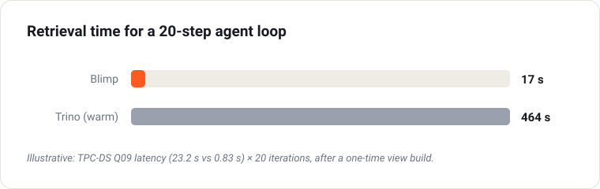

# Blimp prod-source kit

## Blimp

Sub-second data for AI agents. Retrieval is the bottleneck, not the model: Blimp writes the materialized views for your complex queries itself and caches them next to the GPUs, so every later call is a sub-second read. Launch a scalable Blimp node on any server, cloud instance, container or function runtime beside your existing pipeline — nothing migrates, cost drops → [blimp.software](https://blimp.software)

### The problem — agents wait on data, not on the model

- **10+ minutes per agent task** — that is what multi-shot agent queries cost OpenAI's own data team (Rows & Columns Summit, Sep 2026). If it happens at OpenAI, it happens at every company putting agents on its data.
- **Retrieval is the bottleneck** — inference returns in under a second; the complex lakehouse query behind it takes 20+ s. Nested subqueries and multi-way joins rescan the table on every iteration, so 20 steps × 23 s is almost 8 minutes of retrieval.
- **Split across two clouds** — GPUs run on a neocloud while RAG analytics and big data sit at a hyperscaler. You pay egress every time data crosses, so performance is hard to scale and cost hard to control.

The data layer was built for dashboards a human reads once, not for agents that query the same data in loops.

### The insight — everyone optimizes inference. We optimize retrieval inside the loop.

- Agents reason in loops — multi-shot queries and reinforcement-learning steps hit the data layer again and again before reaching the right answer.
- A faster engine still rescans the full table on every call, so latency and cost climb as data grows.
- Blimp writes the view itself, builds it once, then merges only new data. Every later call is a sub-second read; cost tracks new data, not the table.
- Coverage compounds: a new query inside an existing view's branch is served at refresh speed, so the hit rate rises as views accumulate.
- The LLM receives only the data it needs — fewer round trips, lower latency, fewer tokens.
- **Only Blimp writes and maintains views for complex queries on its own, for any engine, next to the GPUs.**



Retrieval time for a 20-step agent loop: **464 s** on warm Trino against **17 s** on Blimp. Illustrative, from TPC-DS Q09 latency (23.2 s vs 0.83 s) over 20 iterations, after a one-time view build.

### Security — distributed ledger zero-trust

Identity is cryptographic rather than credential-based, so nothing in the pipeline is trusted by default.

- **Ledger-anchored identity** — every gateway, storage node and client holds a key pair anchored to a distributed ledger, so identity cannot be assumed by holding a stolen API key.
- **Signed, nonce-bound messages** — every inter-node message is signed and bound to a nonce, blocking replay and man-in-the-middle attacks.
- **Split-key authorization** — sensitive operations need sequential signatures from the client and an authorization server, so no single compromised key can act alone.
- **Tamper-evident history** — object version history and access grants are anchored to the ledger, making retroactive changes cryptographically detectable rather than dependent on access controls alone.
- **Per-node policy** — encryption at rest, ACID guarantees and immutability are set per node.

As autonomous agents gain access to enterprise data, an agent that can impersonate a service or replay a request becomes an attack vector. Per-message signatures and cryptographic identity close that path. Full details: [blimp.software/docs#security](https://blimp.software/docs#security)


`run-blimp` connects a **Blimp node** to **your application**, which can use
it for cache or query engine within your environment.

```
   ┌───── your node (any cloud) ─────┐     ┌─────── Blimp node ───────┐
   │  blimp CLI                      │     │  gateway                 │
   │  REST catalog  :8181  ──────────┼────▶│   S3 :9000               │
   │  your S3 / MinIO data           │ wire│   eblobbers              │
   └───────────────┬─────────────────┘     └───────────┬──────────────┘
                   └────── snapshot_changed webhook ─────┘
                          (your pipeline, on each commit)
```

The kit runs anywhere with a shell and network access to the Blimp node: a
bare-metal server, a VM, a container, a CI runner or a function runtime — and
on the Blimp node itself (the default on-prem layout, where it is installed
by the deploy). `--setup` probes how it can reach the node's gateway: on the
same private network it uses the private address and the node's own identity
(nothing to type); otherwise it uses the public endpoint. Where the DATA lives
is a separate choice (B below): the node's own fleet cache layer needs no keys
at all; another S3-compatible endpoint (MinIO, Ceph, R2, any cloud's S3) takes
its endpoint URL and keys.

For **production**, keep the client on the same private network as the Blimp
node so origin reads never leave it; a different network or cloud works but
adds hops and, across providers, egress cost on every read.


## Install

`blimp` is a self-contained CLI — install it once, then it bootstraps its own
prerequisites on first `--setup`. Two supported ways to get it:

```bash
# 1. one-line installer (open repo, no Docker) — puts `blimp` on your PATH
curl -fsSL https://raw.githubusercontent.com/0chain/run-blimp/main/install.sh | sh

# 2. or just clone and run in place
git clone https://github.com/0chain/run-blimp && cd run-blimp && ./blimp
```

You need **nothing** pre-installed — `blimp --setup` installs what it uses
(docker for the catalog, python + pyiceberg, aws CLI, duckdb, unzip). Set
`BLIMP_SKIP_DEPS=1` on hardened/offline hosts to manage deps yourself.

> **Docker alternative** (optional): a prebuilt image bundles everything, for
> hosts where you'd rather not install anything on the OS:
> ```bash
> docker build -t blimp-kit . && \
> docker run --rm --network host -e CLUSTER_ID=… -e CLUSTER_TOKEN=… -e WAREHOUSE=s3://… blimp-kit --setup
> ```
> `--network host` lets it use the node's own identity and reach the gateway
> on its private address (that is what makes the key-free path work). See `docker-compose.yml`
> to bring up the catalog + CLI together.

## Quick start — the `blimp` command, beginning to end

```
blimp                 list the commands
blimp --setup         connect a Blimp node to your data (interactive)
blimp --query         prove authoring + CDC delta-merge (a TPC-DS query with --tpc, your own SQL with --sql)
blimp --storage       storage suite: TTFB, warp PUT/GET, MLPerf resnet50
blimp --acid          ACID / linearizability check of both data paths
blimp --update        update software on the node: status | all | zs3,eblobber,nessie,gotenberg,rclone
                      (--tag svc=tag, --dry-run; runs on the node via its :9401 helper, one at a time)
```

Wiring is saved to `~/.blimp_env` by `--setup`; every command reads it.
**Running a command with no wiring offers to run `--setup` for you first.**

Rough timing: `--setup` about 10-15 minutes end to end (longer at SF100+),
`--query` about 5 minutes per query at SF1 (at SF1000 a cold author plus
tick is 1-20 minutes depending on the query), `--storage` tens of minutes —
the first run is dominated by generating the mlperf dataset, which later runs
reuse (`MLPERF_REGEN=1` regenerates it) — and `--acid` about 5 minutes.

**Zero-touch / CI:** every prompt is skipped when its env var is pre-set —
export these (or source a file with `set -a`) and `--setup` runs unattended:

```
REGION CLUSTER_ID ICEBERG_URL WAREHOUSE ORIGIN_BUCKET NAMESPACE \
CLUSTER_TOKEN           # the account fleet token (panel: Settings -> API token); read from the
                        #    node itself when --setup runs on the Blimp node, required elsewhere
S3_KEY S3_SECRET        # only for an S3 endpoint you own (B = 3); options 1 and 2 need none
GW                      # optional — defaults from the network assessment (the private address,
                        #    else blimp-<CLUSTER_ID>-0.blimp.software)
GW_AK GW_SK             # optional — the gateway's own S3 keys: read from the local gateway when
                        #    --setup runs on the node, else fetched from the gateway with CLUSTER_TOKEN
CATALOG_CHOICE=1|2|3    # A. Iceberg catalog: 1 = the node's own Nessie (default, nothing to
                        #    install; warehouse NAME via ICEBERG_WAREHOUSE, default "mv"),
                        #    2 = stand a Nessie up on this box (:8181), 3 = ICEBERG_URL you have
SOURCE_CHOICE=1|2|3     # B. dataset location: 1 = the fleet cache layer (default; the fleet
                        #    S3 URL + keys are fetched from the gateway), 2 = this node's own
                        #    gateway S3 (keys read from the node), 3 = another S3 endpoint
BUILD_DATASET=1|2       # C. 1 = generate a TPC-DS test set at B and register it in A (default),
                        #    2 = bring your own data (ORIGIN_BUCKET/NAMESPACE)
BLIMP_SF=1|10|100|1000  #    scale factor for C = 1; when set, the scale prompt is skipped
```

Option 1 + 1 is the internal path: a node with no catalog, no bucket and no
data gets a working cluster in one command. Picking another S3 endpoint (B = 3)
with the node's Nessie (A = 1) is refused and demoted to a local catalog: the
gateway can only write table metadata into a warehouse *it* has configured,
which lives on the fleet endpoint, and the source config carries one
endpoint/key pair.

**What `--query` measures.** The suite runs against the source `--setup` wired
(the gateway calls it `customer`): phase 1 authors an MV from it and verifies
it, phase 2 appends rows to it (`seed_tpcds.py --tick`) and fires
`/admin/source/snapshot_changed`, phase 3 re-runs the query so the gateway
delta-merges the appended rows into the MV, phase 4 (`--verify`) runs the
original query over base and compares its result md5 with the tick's.
`--evict` forces a cold author first. Two verifications exist and are easy to
confuse: the **author verify** (the node row-hashes every newly authored MV
against the original query before banking it — always on, reported as
`verify_ms`) and **`--verify`** (phase 4: the tick's served answer vs the
original query over base — off by default, because it costs one full
original-query run). Every phase shows up as a run on the
node panel's Query tab. `BLIMP_INGEST=1` additionally copies the namespace
into the cluster warehouse first (`/prod/ingest`, a full copy); it is not part
of the measurement.

### Step 1 — create a Blimp node

blimp.software → Create a Blimp node. Note the **node id**.

### Step 2 — `./blimp --setup` on your Iceberg node

Fully **interactive** — every value is prompted with a default (Enter accepts);
any env var already set skips its prompt (that's the zero-touch/CI path).
**The whole session, taking every default except the cluster id:**

```
$ blimp --setup

== blimp --setup — connect a Blimp node to this node's data ==
  ✓ deps ready (python: ~/.blimp_venv/bin/python3)
S3 region (cloud buckets only; any value for MinIO/other S3) [us-east-1]:
Blimp cluster id (from blimp.software): 1700000000000

network assessment → private gateway 10.0.1.23 reachable: yes (private path, nothing to type)
Blimp gateway address [10.0.1.23]:
Iceberg namespace [tpcds]:

Iceberg catalog
   1) use this cluster's gateway Nessie catalog (default, nothing to install)
   2) stand up an Iceberg REST catalog on THIS box (:8181)
   3) point at an Iceberg REST catalog I already have
  choice [1]:
  using the gateway Nessie catalog — http://127.0.0.1:19122/iceberg (branch main)
  Nessie warehouse name [mv]:
    warehouse "mv" -> s3://tpcds-mv (table metadata lands there)

Dataset (source) location
   1) the fleet cache layer — https://fleet-<account>.blimp.software:9443 (default)
   2) this node's own gateway S3 — http://10.0.1.23:9000 (nothing to install)
   3) another S3 endpoint (your own bucket / MinIO / other cloud)
  choice [1]:
  Bucket on the fleet endpoint [blimp-src]:
  source → https://fleet-<account>.blimp.software:9443/blimp-src (fleet keys, fetched from the gateway)

Build a TPC-DS test dataset at that location?
   1) yes (default)
   2) no — I will bring my own data
  choice [1]:

Scale factor
   1) SF1    ~1 GB   (default — minutes)
   2) SF10   ~10 GB  (tens of minutes)
   3) SF100  ~100 GB (hours)
   4) SF1000 ~1 TB   (many hours; needs a big box + disk)
   5) SF10000 / 6) SF100000 (dedicated data disk)
  choice [1]:
  will generate TPC-DS SF1 and register it into the catalog
  Warehouse (Nessie: a warehouse NAME; otherwise s3://bucket/prefix) [mv]:
```

That is the last prompt. Everything after it runs unattended: generate,
upload, register, save `~/.blimp_env`, wire the node, install the test tools.

**Bringing your own catalog and bucket** replaces three of those answers:

```
Iceberg catalog
  choice [1]: 3
  Iceberg REST URL: http://catalog.internal:8181
  REST prefix (Nessie branch; blank for a plain REST catalog):

Dataset (source) location
  choice [1]: 3
  Data bucket (blank = generate one here): my-lake
  S3 endpoint URL of that bucket (MinIO/Ceph/R2/any cloud, e.g. http://minio:9000;
    blank = your cloud's S3 in us-east-1) [https://s3.us-east-1.amazonaws.com]: http://minio.internal:9000

Build a TPC-DS test dataset at that location?
  choice [1]: 2
  Warehouse (Nessie: a warehouse NAME; otherwise s3://bucket/prefix) [s3://my-lake/wh]:
```

The prompts, in order (Enter takes the default; a pre-set env var skips the prompt):

1. `S3 region [us-east-1]` — only meaningful for a cloud bucket; any value otherwise
2. `Blimp cluster id (from blimp.software)` — required
3. `Blimp gateway address [<derived from the cluster id>]` — then the network
   assessment picks the private or the public path to it
4. `Iceberg namespace [tpcds]` — then the fleet token: read from the node when
   `--setup` runs on it, otherwise prompted (or `CLUSTER_TOKEN`)
5. **A. Iceberg catalog** — `1) use this cluster's gateway Nessie (default)`,
   `2) stand up a Nessie on THIS box (:8181)`, `3) point at a catalog I already have`.
   Option 1 asks `Nessie warehouse name [mv]` and probes it; option 3 asks the
   REST URL and its prefix (blank for a plain REST catalog).
6. **B. Dataset (source) location** — `1) the fleet cache layer (default)` →
   `Bucket on the fleet endpoint [blimp-src]` (fleet URL + keys are fetched from
   the gateway, nothing to type); `2) this node's own gateway S3` (keys read from
   the node); `3) another S3 endpoint` → data bucket (blank = generate one here)
   and its S3 endpoint URL (MinIO, Ceph, R2, any cloud's S3; blank = your
   cloud's S3 in the region above).
   Picking 3 with option A1 is refused and demoted to a local catalog (see the
   note under the env block).
7. **C. Build a TPC-DS test dataset at that location?** — `1) yes (default)` →
   `Scale factor 1 / 10 / 100 / 1000 / 10000 / 100000` (skipped when `BLIMP_SF`
   is set); `2) no, I bring my own data`.
8. `Warehouse` — prefilled with the Nessie warehouse NAME (A1/A2) or
   `s3://<data-bucket>/wh` (A3)
9. S3 access key / secret — asked only for an S3 endpoint you own that the node
   cannot reach with its own identity; the fleet option needs none

With C = yes it then generates the 24 tables (duckdb `dsdgen`), uploads them to
the location from B, and registers them into the catalog from A. Nothing else
is asked.

Guardrails `--setup` enforces (each is a real failure mode):

1. **Warehouse co-located with the data bucket.** A warehouse in a different
   bucket breaks the gateway's catalog-metadata reads → MV author refuses
   ("grain not sampleable"). Divergence warns and offers to fix.
2. **Bucket access grant** (vpc/same-account): applies a bucket policy for the
   gateway's own identity + your account — no silent 403 at author time.
3. **Blank keys are the normal answer** — keys are only typed for an S3
   endpoint you own that the node cannot reach with its own identity.

**What `--setup` does, in order:**

1. **Deps bootstrap** — installs docker / python venv + pyiceberg / aws CLI /
   unzip if missing (`BLIMP_SKIP_DEPS=1` to manage yourself).
2. **Network assessment** — probes the gateway's private address → private
   path (nothing to type) or the public endpoint.
3. **Catalog (A)** — the gateway's own Nessie (nothing to run), a Nessie stood
   up here with the same recipe as the node's (`docker run`, :8181), or a REST
   catalog you already have. Both Nessie options are one catalog type, so
   there is one dialect to reason about; a Nessie warehouse is a server-side
   NAME (`mv`), never an `s3://` path.
4. **Dataset (B) + test set (C)** — generate TPC-DS at the chosen scale, upload
   it to the fleet cache layer (or your S3), register the tables into A.
5. **Bucket grant** — only when the bucket is in the same cloud account as the
   node (a bucket policy for the gateway's role); every other endpoint is
   reached with the keys you gave, nothing to grant.
6. **Saves the wiring** to `~/.blimp_env` (mode 600) for every later command.
7. **Wires the Blimp node over its admin API** — no SSH, no restart:

   ```
   POST http://<gateway>:9000/admin/source/configure
   Authorization: Bearer <CLUSTER_TOKEN, the account fleet token>
   {"source":"customer","iceberg_url":"<catalog as the GATEWAY reaches it>|<warehouse>",
    "namespace":"…","bucket":"…","s3_endpoint":"…","s3_key":"…","s3_secret":"…","s3_region":"…"}
   ```

   Two addresses for one catalog: with option A1 you reach the gateway's Nessie
   on the host port (`http://<gateway>:19122/iceberg`), but the gateway runs in
   a container where that is loopback to itself, so `--setup` sends the
   gateway its own catalog address (read from the co-located container) and
   keeps the host address for the registrar and seeder. The bearer is the
   account fleet token (`CLUSTER_TOKEN`). The gateway applies the config live —
   the very next query reads your data — and persists it across restarts. On
   success `--setup` prints `✓ cluster wired: source=customer … (live, no restart)`.
8. **Finishing** — fetches the gateway's S3 keys into `~/.blimp_env` and
   installs the benchmark tools (`warp`, `mount-s3`, `dlio`, the ACID checker).

Finally it prints the same values for the Blimp node UI (Query Optimizer →
Production, the manual path) and the `snapshot_changed` webhook for your
pipeline.

### Step 3 — register your tables (optional)

`--setup` already registers the test dataset it generates. Do this only for
**your own** parquet that is not in the catalog yet — it is `add_files`
registration, so no data is copied:

```
~/.blimp_venv/bin/python3 register_tpcds_tables.py \
  --catalog http://localhost:8181/iceberg --prefix main --warehouse src \
  --source-bucket my-bucket --namespace myns \
  --s3-endpoint http://minio.internal:9000 --s3-key … --s3-secret …
```

Against **Nessie** (both catalog options the kit stands up, and the Blimp
node's own) `--warehouse` is the server-configured **name** (`src`, or `mv` on
the node) and `--prefix` is the branch, normally `main`. Against a plain REST
catalog drop `--prefix` and pass the warehouse as an `s3://…` path. Omit
`--s3-*` when the host reaches the bucket with its own identity.

### Step 4 — point the Blimp node at the source (optional)

**Automatic (no SSH):** `--setup` wires the node itself over the authenticated
admin API — `POST http://<gw>:9000/admin/source/configure`, with the account
fleet token as the bearer (read from the node when the kit runs on it, else
`CLUSTER_TOKEN` from the env or `~/.blimp_env`). The gateway applies the source in
its live env (effective on the next query, **no restart**) and persists it
across reboots. On an older gateway image the call fails gracefully and
`--setup` prints the manual steps.

Manual fallback (older gateway image, or the admin-API call failed): paste
`--setup`'s printed values into the Blimp node UI (Production tab).

An S3 endpoint you own (B = 3) **requires** `S3_KEY`/`S3_SECRET`; `--setup`
sends them in the `/admin/source/configure` body. For the fleet cache layer,
or a bucket the node reaches with its own identity, leave them unset.

> Firewall: this only applies when the catalog runs **here** (A = 2 or 3) — the
> gateway must reach it on the catalog port. If 8181 is closed between the two,
> publish it on an open port (`ICEBERG_PORT=8081 blimp --setup`) and use that
> URL. With the default A = 1 the catalog is the node's own, so there is
> nothing to open.

## Fleet — one S3 URL for all your nodes

When you run more than one Blimp node, they form a **fleet** with a **single
S3 endpoint** and **one shared key** — you never juggle per-node URLs. Point any
S3 tool or a `mount-s3` (FUSE) client at it and you see your **entire namespace**,
no matter which node stores each object; content is deduplicated fleet-wide
(identical data kept once across all nodes), and the URL is round-robin +
health-checked, so a node going down moves traffic to a healthy one.

- **Endpoint:** `https://fleet-<account>.blimp.software:9443` (TLS, path-style)
- **Credentials:** your account's shared fleet S3 key (Access + Secret)
- **S3 tools:**
  ```
  mc alias set fleet https://fleet-<account>.blimp.software:9443 <AK> <SK>
  aws --endpoint-url https://fleet-<account>.blimp.software:9443 s3 ls
  ```
- **FUSE (mp-s3) — same endpoint, same key:**
  ```
  mount-s3 --force-path-style --endpoint-url https://fleet-<account>.blimp.software:9443 <bucket> /mnt/fleet
  ```

Any node resolves the full namespace (content-addressed dedup index +
cross-node fetch), and a cross-node read that hits a transient break is retried
**server-side** — the client never sees a truncated stream. Prefer the fleet URL
over a per-node `blimp-<node>-0.blimp.software:9443` for anything user-facing.

> One connection lands on one node, so a **single** client is bounded by that
> node's link — run several clients (or several mounts) to aggregate across the
> fleet. `blimp --storage` deliberately does **not** do this: it drives the one
> node in `~/.blimp_env` (`GW`) so the numbers describe that node's storage. To
> measure the fleet, run the suite from several clients at the fleet URL.

> **Dedup and benchmarks.** Because identical content is stored once fleet-wide,
> the *second* node to write the same bytes keeps only the name — reads there are
> served from the node that holds them. That is correct for storage and wrong for
> a storage benchmark, which would then be measuring the link between nodes. The
> mlperf leg prints a `cross-node` count for exactly this reason, and the bench
> upload asks the gateway to keep a local copy (`x-amz-meta-zus-dedup: off`) so
> the measurement stays on the node under test.

## Testing the Blimp node

The `--query` and `--storage` commands are **testing/validation
tools** — they prove the wiring, measure the node, and gate a rollout. They are
not part of production operation (production is your pipeline + the
`snapshot_changed` webhook from Step 4).

### A — `./blimp --query` (prove authoring + CDC)

**What it does.** Four phases against the source `--setup` wired, per query:

| phase | what happens | what you get |
|---|---|---|
| 0 (with `--evict`) | drop each query's MV, keep its recipe | a genuinely cold start |
| 1 | run the query → the node authors an MV from your source | `author_ms`, `materialize_ms`, `verify_ms`, `cold_serve` |
| 2 | append rows to the source, then `POST /admin/source/snapshot_changed` | the appended row counts + new snapshot ids |
| 3 | run the query again → the node delta-merges the appended rows | `merge_ms`, `mode`, `incr_query` (the warm serve) |
| 4 (with `--verify`) | run the original query over base, compare with the tick's served result | `verify: MATCH / MATCH(float) / MISMATCH` |

**One query, three ways.** Phases 2-3 (append + tick) always run; what changes
is whether the MV is rebuilt and whether the tick's answer is checked:

```
blimp --query --sql ./my_query.sql          # the same three ways work with your own SQL file in place of --tpc
blimp --query --tpc 3                      # 1. as-is: serve the MV the node already has (authors only if none), append, tick
blimp --query --tpc 3 --evict              # 2. cold: evict the MV, re-author it (+ author verify), append, tick
blimp --query --tpc 3 --evict --verify     # 3. cold + post-verify: as 2, then the tick's answer vs the original query over base
```

```
blimp --query                                  # the default batch, 10 queries
blimp --query --tpc "3 7 19"                   # pick TPC-DS queries
blimp --query --sql ./my_query.sql             # YOUR SQL file
blimp --query --sql ./queries/                 # a directory of .sql files
blimp --query --evict --verify                 # cold start + correctness check
blimp --query --append-rows 50000              # bigger CDC tick (default 5000)
blimp --query --all                            # all 99 TPC-DS queries
blimp --query --second-40                      # named batches: --first-10 (default), --second-40,
                                               #   --third-30, --fourth-19 (together = all 99); they stack
```

`--sql` sends the query in your `.sql` file. It can read any table registered
in the Iceberg catalog — the node's DuckDB loads those tables to author the MV
and answer the query. The tables are parsed from the query's `FROM`/`JOIN`
clauses and checked against the catalog, and the **fact** is the referenced
table with the most rows (the node's own rule), so `snapshot_changed` fires for
exactly the tables the query touches. Only the phase-2 append (the rows added
before the tick) is TPC-DS-specific: the built-in seeder writes TPC-DS rows, so
on other tables phase 2 reports `CDC TICK FAILED`, nothing is appended, and the
tick measures an unchanged MV. Authoring, the author verify and the serve are
measured either way.

**Reading the result.** One row per query, e.g.:

```
query  fact           mv_rows x cols  author_ms  merge_ms      mode  incr_ms  delta_rows  delta_verdict
q1     store_returns      177924x5         4270     19216  incremental     329          50  merged
```

The `verify` column is `MATCH` / `MATCH(float)` / `MISMATCH` with `--verify`,
`(no --verify)` without it. Under the table each query prints the tick's result
(status, rows, md5) and two links the node hosts — the same pages the node
panel's Query tab opens: `mv:` the MV table, `result:` this tick's result, and
with `--verify` `base:` the original query's answer over base, all paginated in
the browser — so a MISMATCH can be inspected side by side.

`merge_ms` only counts when `delta_verdict` is `merged` — `UNCHANGED` or
`EMPTY` mean the append produced no delta for that MV and the number measured
nothing. `rebaselined` means no delta part was written but the MV content
changed (a full re-aggregation ran instead of a merge); `NO-BASELINE` means the
MV did not exist before the tick, so the merge is unproven, not a result. `mode=incremental` is the delta-merge fast path; `no-delta` is a full
re-author; "no MV — served from base" means the query authored nothing and
scanned the source. There is **no PASS/FAIL verdict**: those outcomes are
judgements, not thresholds. Every phase also appears as a run on the node
panel's **Query** tab.

`--verify` is off by default: the node does not re-check served answers in
production (the author verify already proved the MV), so an unflagged run
measures the production path. Use it to prove a tick's answer is correct.

`UNCHECKED` means phase 4 could not produce a reference: the original query
over base failed (typically it ran out of memory or spill on a very large
query), so the tick's answer is unproven, not wrong. Re-run
`blimp --query --tpc N --verify` on a quiet node with more free disk.

**First tick vs steady state.** Each `--query` run does one append and one tick.
After a cold author (`--evict`) the first tick is the coldest one: caches are
empty and helper units may still be building. Run the same query again without
`--evict` to measure the next tick, which is what every later update costs:

```
blimp --query --tpc 3 --evict              # author + first tick
blimp --query --tpc 3 --verify             # next tick (steady state) + post-verify
```

**Appends stay realistic.** Each tick's fact rows reference dimension keys
from the table as originally loaded (its first Iceberg snapshot), plus only the
few dimension rows that tick itself adds. New dimension rows per tick are a
fixed share of the as-loaded size (`CDC_DIM_RATE`, default 0.0001), and facts
reference new keys only until they reach `CDC_DIM_GROWTH` of it (default 0.01),
e.g. `CDC_DIM_RATE=0.001 blimp --query --tpc 3`. Long benchmark runs
therefore do not inflate dimension cardinalities. Data produced by kits before
this change can be reset by setting each table's current snapshot back to its
first one; earlier snapshots are retained, so this is reversible.

Multi-fact batches still work: `SUITES="store_sales:3 19 43;store_returns:1"`.
Join-CTE queries (q64-class) only see a delta when the append touches **both**
sides of the join — the seeder therefore appends referentially — so a
sales-only append correctly reports `no-delta`, not a bug.

### B — `./blimp --storage` (storage & cache suite)

**What it does.** Drives the node's S3 endpoint from this client and reports
what the storage path actually delivers. Three legs:

| leg | workload | what you get |
|---|---|---|
| `ttfb` | 1 KiB objects, PUT then single-stream GET | first-byte latency (median / 99th) |
| `warp` | 96 MiB objects, PUT then GET, sized to exceed the node's RAM | sustained PUT and GET MiB/s, error count |
| `mlperf` | MLPerf Storage resnet50 (dlio) reading through mountpoint-s3 | accelerator utilisation (AU %), samples/s, MB/s |

```
blimp --storage                          # all three legs (~30 min)
STORAGE_LEGS=mlperf blimp --storage      # one leg
STORAGE_LEGS=warp,ttfb blimp --storage   # several
WARP_BUDGET_MIB=5120 MLPERF_NUM_FILES=35 blimp --storage    # cap sizes on a small node
MLPERF_ACCELS=2 blimp --storage          # more accelerators (more read concurrency)
BENCH_KEEP=1 blimp --storage             # keep the scratch buckets for a re-run
```

Self-contained: it installs its own tools (warp pinned v1.1.4, mount-s3, dlio
+ an MPI runtime) before running, `BLIMP_SKIP_DEPS=1` opts out, and a leg whose
tool still cannot install is skipped loudly rather than reported as zero.

**Reading the result.** The tail of the run prints one summary:

```
  warp    S3 PUT 593 MiB/s · GET 938 MiB/s
  TTFB    median 3ms, 99th 6ms
  mlperf  read AU 97.16% · 4062 samples/s · 557 MB/s
  mlperf  cross-node: 0 — all reads served by this node's blobbers
```

AU is the MLPerf verdict — it is the fraction of time the accelerator had data
to work on, so ≥90% means storage kept up. The **cross-node** line matters on a
multi-node fleet: identical content is stored once, so a node that did not
write the dataset reads it from the node that did, and a non-zero count means
the number above measured the link between nodes rather than this node's own
storage. Each leg also registers itself on the node panel's **Benchmarks** tab,
so a client-run result sits next to the ones started from the UI.

### C — Testing ACID (`blimp --acid`)

A Blimp node is not a single disk — a write is erasure-coded across many
independent blobbers, and reads are served through several front-ends (the
gateway S3 API, a read-through cache, a mounted filesystem). `--acid` proves
that this distributed stack still behaves like one correct store: a value you
just wrote is the value everyone reads, and a read that races an overwrite
never returns a stale copy or a torn mix of the old and new bytes.

> **ACID is OFF by default on the gateway, and `--acid` turns it on for you.**
>
> `blimp --acid` arms it via `POST /admin/acid` before the run and restores the
> previous setting afterwards — including on failure or Ctrl-C. That pin is a
> RUNTIME setting and is not persisted, so a gateway restart reverts to the
> node's configured default.
>
> **If you run the porcupine checker by hand, arm it yourself first** — a
> linearizability test against a gateway with ACID off is measuring the wrong
> configuration, and any torn read it reports says nothing about the ACID path:
>
> ```bash
> set -a; . ~/.blimp_env; set +a          # GW + CLUSTER_TOKEN (the account fleet token)
> curl -X POST http://$GW:9000/admin/acid \
>   -H "Authorization: Bearer $CLUSTER_TOKEN" \
>   -H 'Content-Type: application/json' -d '{"enabled":true}'
> # ... run the test ...
> curl -X POST http://$GW:9000/admin/acid \
>   -H "Authorization: Bearer $CLUSTER_TOKEN" \
>   -H 'Content-Type: application/json' -d '{"enabled":false}'
> ```
>
> Leaving it pinned on makes every LATER benchmark quietly pay the ACID cost —
> which is exactly how a misleading measurement gets made.

It uses [porcupine](https://github.com/anishathalye/porcupine), the same
linearizability model-checker used in Jepsen distributed-systems testing. Many
clients hammer the same keys with concurrent writes and reads; porcupine then
searches for *any* ordering of those operations consistent with a single
correct register. If none exists, the history is **NOT LINEARIZABLE** and the
offending operation is reported. It runs against **both read paths**, each
under two profiles:

| Path | What it is |
|------|------------|
| **gateway S3 :9000** | the raw S3 API → gosdk → blobbers |
| **mountpoint-s3** | the gateway bucket mounted as a POSIX filesystem (the mlperf / customer mount path) |

- **single-writer** — one client writes a key while N clients read it. This is
  the read-after-write guarantee an object store actually promises; a stale or
  torn read here is a genuine consistency bug.
- **multi-writer** — every client both writes and reads the shared keys, a
  stricter total-order probe. (High "errors" counts on the FUSE leg are
  just the client refusing two concurrent writers to one key — the verdict is
  over the operations that *completed*.)

```bash
blimp --acid
# tune with ACID_CLIENTS (8), ACID_KEYS (4), ACID_DURATION (45s)
```

A clean run prints `LINEARIZABLE` for every leg — read-after-write is preserved
and no torn erasure-decode is ever exposed, whether you reach the node over S3
or as a mounted filesystem. `--setup` builds the checker (a
small Go program under `acid/`) automatically; it needs no configuration beyond
the gateway S3 keys already in your wiring. Run the checker from a box **other
than the gateway** (e.g. the Iceberg node) — co-locating the load generator on a
small gateway can starve it and produce spurious `Illegal` verdicts. (A
concurrent-read `unexpected EOF` from the `warp` load tool specifically is a warp
client artifact, not a consistency failure — verified separately with `aws s3
cp` md5 checks that pass byte-for-byte with the strict ACID verify on and off.)

---

## Reference

- **[TESTING.md](TESTING.md)** — testing the kit itself: `./test_kit.sh`,
  `./test_setup_options.sh`, `python3 test_seed_tpcds.py`. All offline.
- Product docs: [docs.zus.network/zus-docs/webapps/blimp](https://docs.zus.network/zus-docs/webapps/blimp)
  — the optimizer, incremental MVs (CDC), and the Prod-Query & MV API.
